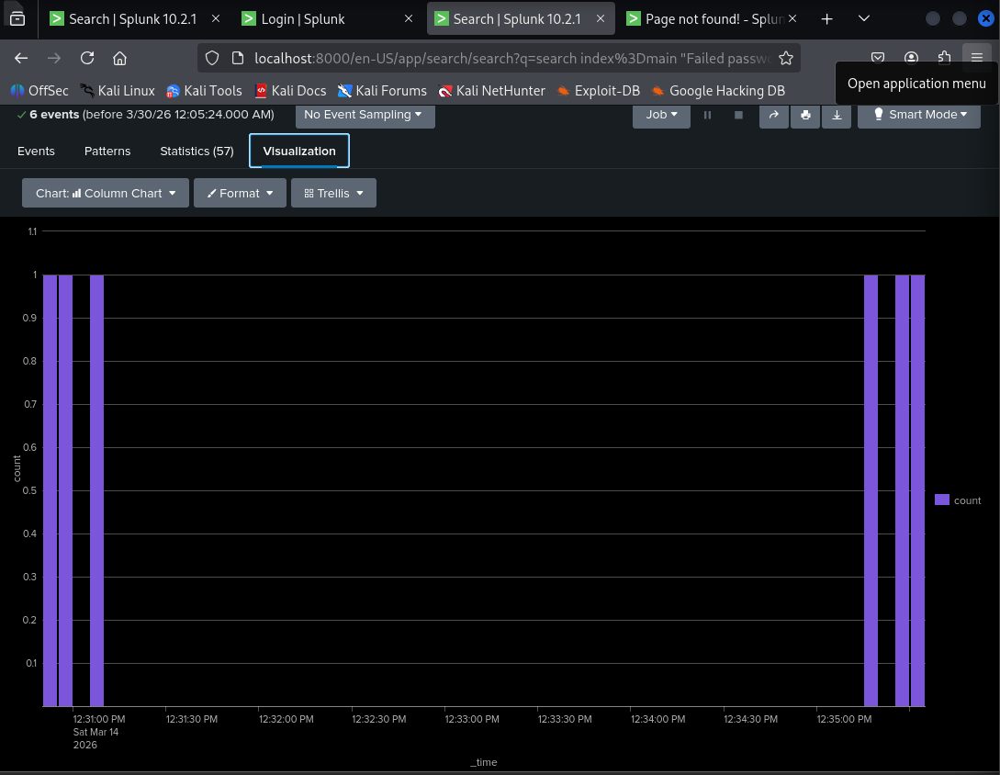

<h1 align="center">Brute Force Attack Detection using Splunk</h1>

SOC Investigation Case Study • Log Analysis • Threat Detection

---

## 📌 Overview
This project presents a Security Operations Center (SOC) investigation of a brute-force attack using Splunk. It demonstrates how authentication logs can be analyzed to detect suspicious activity and identify potential account compromise.

---

## 🎯 Objectives
- Detect repeated failed login attempts  
- Identify attacker source IP  
- Analyze login patterns over time  
- Correlate failed and successful login events  
- Investigate post-login activity  

---

## 🛠️ Tech Stack
| Category | Tools |
|--------|------|
| SIEM | Splunk |
| Attack Simulation | Kali Linux |
| Target System | Ubuntu |
| Logs | /var/log/auth.log |

---

## ⚔️ Attack Scenario
A brute-force SSH attack was simulated in a controlled lab environment using Kali Linux. The attacker generated multiple failed login attempts followed by a successful login, replicating a real-world attack pattern.

---

## 🔍 Analysis Approach
- Detected repeated failed logins  
- Identified attacker source IP  
- Analyzed login patterns over time  
- Correlated events to detect compromise  

---

## 📊 Key Findings
- High frequency of failed login attempts from a single IP  
- Successful login after multiple failed attempts  
- Indicators of possible privilege escalation  

---

## 📸 Sample Output

Example:

---

## 📁 Project Files
- Brute_Force_Detection.pdf → Detailed investigation report  
- queries.txt → Splunk queries used  
- screenshots/ → Visualization of logs and dashboards  

---

## 🧠 Conclusion
The investigation confirms a brute-force attack scenario where unauthorized access was achieved after multiple login attempts. This project demonstrates practical SOC skills including log analysis, event correlation, and threat detection using Splunk.
