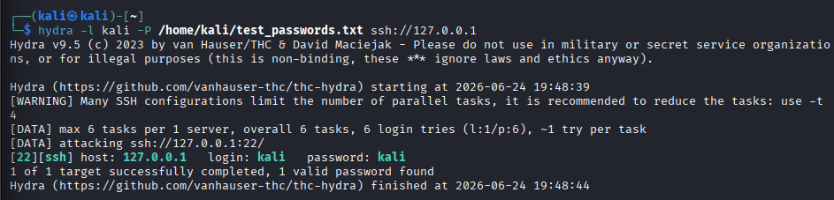
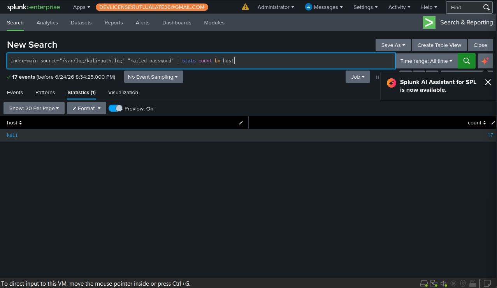
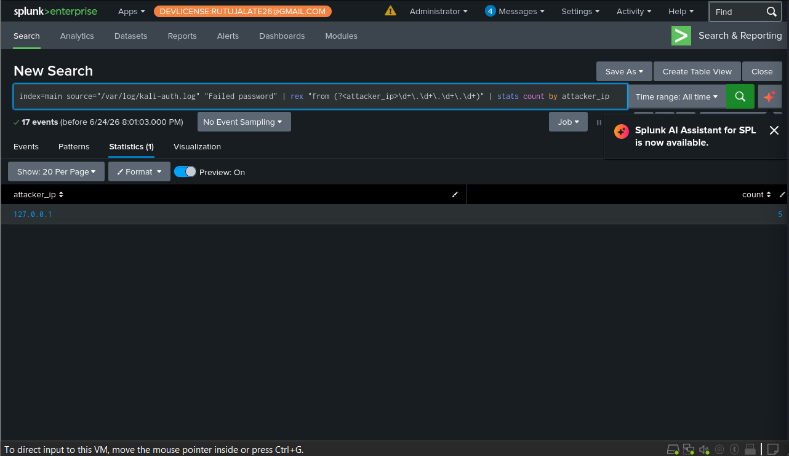
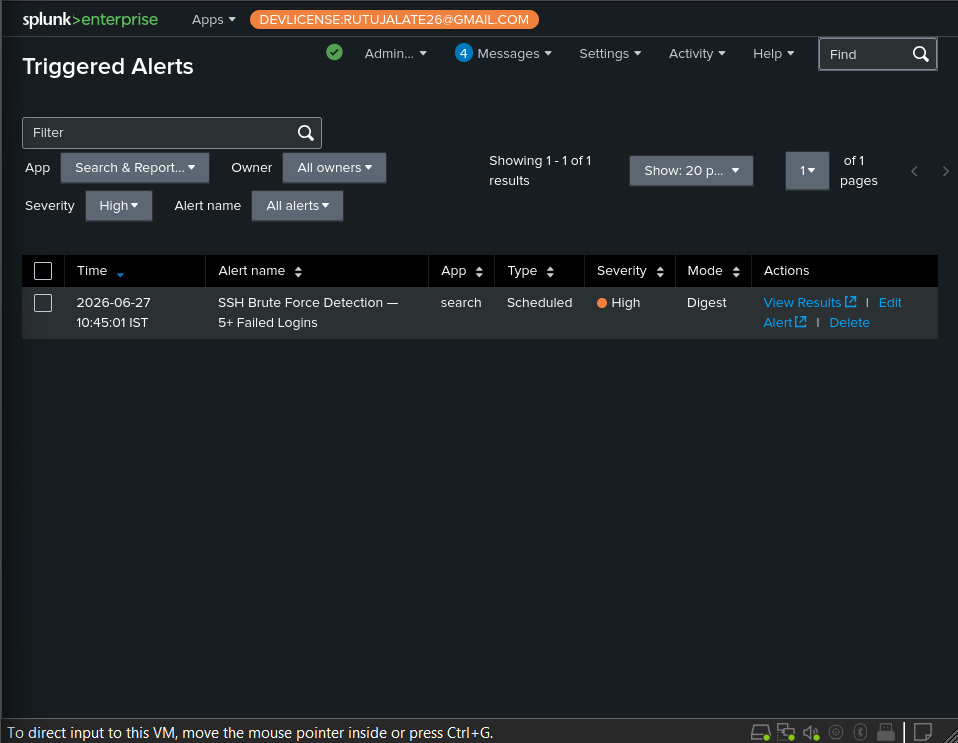
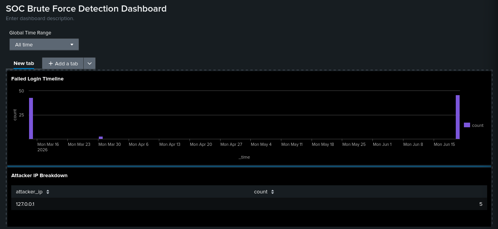
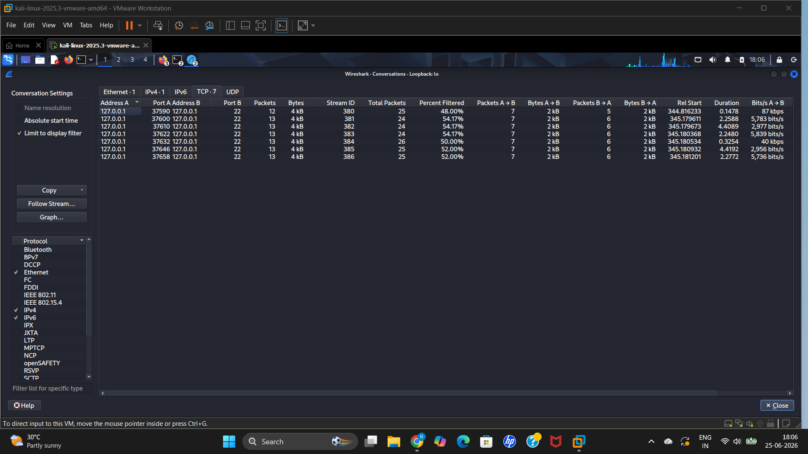
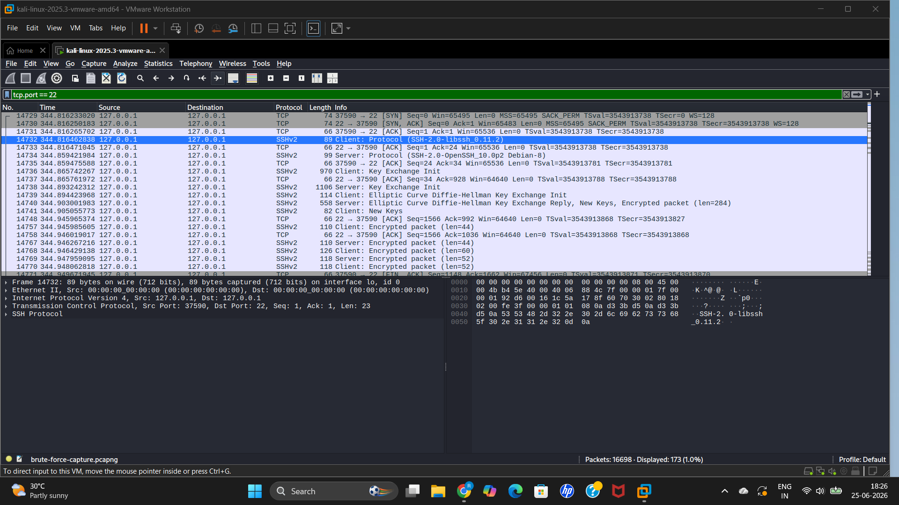
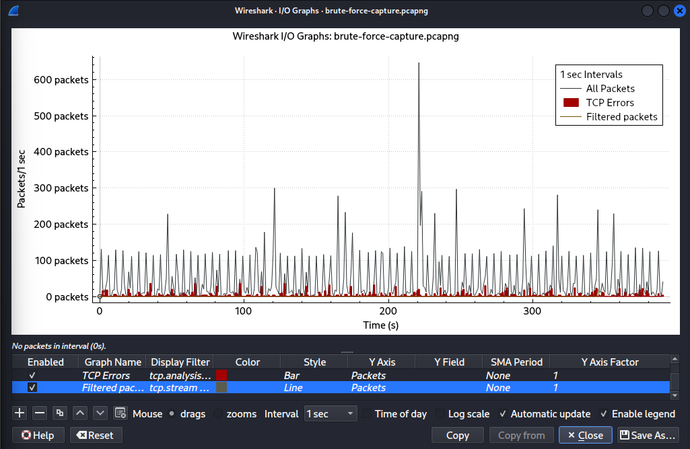
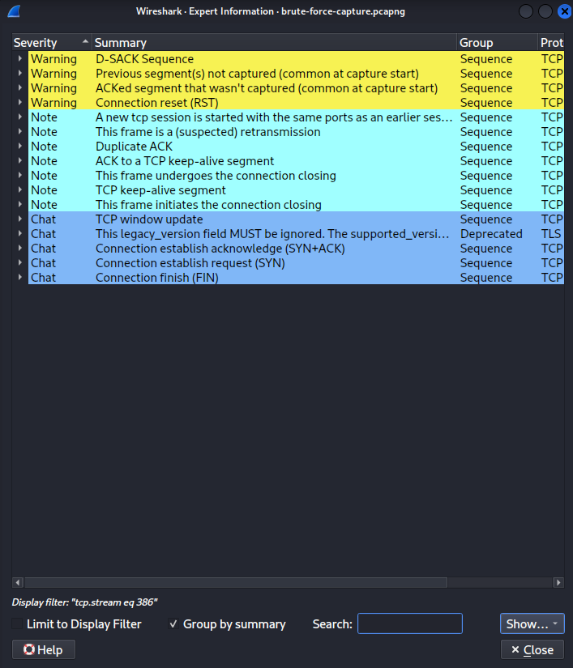

<h1 align="center">Brute Force Attack Detection & Analysis using Splunk</h1>

SOC Investigation Case Study • Log Analysis • Threat Detection • MITRE ATT&CK • Network Forensics

---

## 📌 Overview
This project presents an end-to-end Security Operations Center (SOC) investigation of a brute-force SSH attack. It demonstrates attack simulation, SIEM detection, automated alerting, network traffic analysis, and formal incident response documentation.

---

## 🎯 Objectives
- Simulate SSH brute force attack using Hydra
- Detect attack using Splunk SIEM with SPL queries
- Extract attacker IP using rex command
- Apply threshold-based automated detection
- Build SOC Dashboard for real-time monitoring
- Capture and analyze network traffic using Wireshark
- Map attack to MITRE ATT&CK framework
- Document findings in formal Incident Response Report

---

## 🛠️ Tech Stack
| Category | Tools |
|--------|------|
| SIEM | Splunk Enterprise (Developer License) |
| Attack Simulation | Hydra v9.5 (Kali Linux) |
| Network Analysis | Wireshark 4.4.7 |
| Target System | Kali Linux (localhost SSH) |
| Logs | /var/log/ssh-bruteforce.log |
| Framework | MITRE ATT&CK |

---

## ⚔️ Attack Scenario
A brute-force SSH attack was simulated in a controlled lab environment using Hydra on Kali Linux targeting localhost (127.0.0.1). The attacker generated multiple failed login attempts followed by a successful login, replicating a real-world credential access attack.

**Hydra Command Used:**

    hydra -l kali -P /home/kali/test_passwords.txt ssh://127.0.0.1

**Result:** Password found — kali:kali in under 5 seconds with 5 failed attempts before success.

---

## 🔍 SPL Queries Used

### Failed Login Detection

    index=main source="/var/log/ssh-bruteforce.log" "Failed password"
    | stats count by host

### Threshold-Based Detection

    index=main source="/var/log/ssh-bruteforce.log" "Failed password"
    | stats count by host
    | where count > 3

### Attacker IP Extraction

    index=main source="/var/log/ssh-bruteforce.log"
    | rex "from (?<attacker_ip>\d+\.\d+\.\d+\.\d+)"
    | stats count by attacker_ip

### Failed Login Timeline

    index=main source="/var/log/ssh-bruteforce.log"
    | timechart count

---

## 📊 Key Findings
| Finding | Detail |
|---------|--------|
| Attacker IP | 127.0.0.1 |
| Failed Attempts | 5 |
| Successful Login | 1 |
| Attack Duration | ~5 seconds |
| Detection Method | Threshold >= 5 failed logins within 5 minutes |
| Attack Tool Fingerprint | SSH-2.0-libssh_0.11.2 (identified via Wireshark) |

---

## 🚨 Automated Alert
Configured Splunk scheduled alert to automatically detect brute force attacks:

- Alert Name: SSH Brute Force Detection — 5+ Failed Logins
- Schedule: Every 5 minutes (Cron: */5 * * * *)
- Condition: 5 or more failed login attempts from same IP
- Severity: High
- Action: Add to Triggered Alerts

---

## 📈 SOC Dashboard
Built using Splunk Dashboard Studio with two panels:
- Failed Login Timeline — timechart visualization of attack pattern
- Attacker IP Breakdown — table showing source IP and attack count

---

## 🌐 Wireshark Network Analysis
Captured and analyzed network traffic during the brute force attack using Wireshark.

**Capture Details:**
- File: brute-force-capture.pcap
- Interface: Loopback (lo)
- Total Packets: 16,698
- Filter: tcp.port == 22 (173 SSH packets displayed)

**Key Findings:**
- 7 TCP connections to port 22 — one per password attempt
- Attack tool identified via SSH fingerprint: SSH-2.0-libssh_0.11.2
- Failed connections terminated with RST packets
- Successful connection closed gracefully with FIN packet
- IO Graph shows sudden traffic spike to 600+ packets/sec during attack

---

## 🎯 MITRE ATT&CK Mapping
| Field | Detail |
|-------|--------|
| Tactic | Credential Access |
| Technique | T1110 — Brute Force |
| Sub-technique | T1110.001 — Password Guessing |
| Detection | AN1275 — High volume failed logins followed by success |

**Mitigations:**
- Account lockout policy
- Multi-Factor Authentication (MFA)
- SSH key-based authentication
- fail2ban implementation
- IP whitelisting

---

## 📄 Incident Response Report
A formal Incident Response Report was documented following SOC investigation standards.

[View IR Report](IR-2026-001_Brute_Force_SSH_Attack_Rutuja_Late.pdf)

**Report Sections:**
- Executive Summary
- Incident Details
- Attack Timeline
- Evidence (Splunk + Wireshark)
- MITRE ATT&CK Mapping
- Root Cause Analysis
- Recommendations
- Conclusion

---

## 🧠 Conclusion
This project demonstrates end-to-end SOC analyst skills — attack simulation, SIEM detection, threshold-based automated alerting, network traffic analysis, MITRE ATT&CK mapping, and formal incident response documentation. These are core skills required in real-world SOC environments.

---

## 📁 Project Files
- IR-2026-001_Brute_Force_SSH_Attack_Rutuja_Late.pdf → Formal IR Report
- screenshots/ → All evidence screenshots
- README.md → Full investigation documentation
